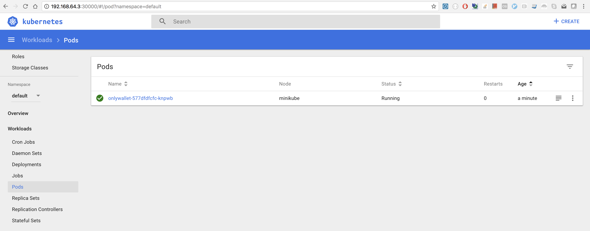

build/run ccontainer
----------------

```
docker build -t onlywallet-api:v1 .
docker run -it -p 8080:8080 onlywallet-api:v2
```

setup kubectl
-------------

```bash
minikube start --vm-driver=xhyve
Starting local Kubernetes v1.10.0 cluster...
Starting VM...
WARNING: The xhyve driver is now deprecated and support for it will be removed in a future release.
Please consider switching to the hyperkit driver, which is intended to replace the xhyve driver.
See https://github.com/kubernetes/minikube/blob/master/docs/drivers.md#hyperkit-driver for more information.
To disable this message, run [minikube config set WantShowDriverDeprecationNotification false]
Downloading Minikube ISO
 150.53 MB / 150.53 MB [============================================] 100.00% 0s
Getting VM IP address...
Moving files into cluster...
Downloading kubeadm v1.10.0
Downloading kubelet v1.10.0
Finished Downloading kubelet v1.10.0
Finished Downloading kubeadm v1.10.0
Setting up certs...
Connecting to cluster...
Setting up kubeconfig...
Starting cluster components...
Kubectl is now configured to use the cluster.
Loading cached images from config file.
```

```bash
kubectl config use-context minikube
```

```bash
kubectl cluster-info
Kubernetes master is running at https://192.168.64.3:8443
KubeDNS is running at https://192.168.64.3:8443/api/v1/namespaces/kube-system/services/kube-dns:dns/proxy

To further debug and diagnose cluster problems, use 'kubectl cluster-info dump'.
```

```
minikube dashboard
```

kubectl deployment
---------------------

A Kubernetes Pod is a group of one or more Containers, tied together for the purposes of administration and networking. The Pod in this tutorial has only one Container.

```bash
docker build -t onlywallet-api:v1 .
eval $(minikube docker-env)
kubectl run onlywallet-pod --image=onlywallet-api:v1 --port=8080

kubectl get deployments
kubectl get pods
kubectl get events
```

kubectl congig
---------------

- resides in `~/.kube/config`

```bash
kubectl config view
apiVersion: v1
clusters:
- cluster:
    certificate-authority: /Users/prayagupd/.minikube/ca.crt
    server: https://192.168.64.3:8443
  name: minikube
contexts:
- context:
    cluster: minikube
    user: minikube
  name: minikube
current-context: minikube
kind: Config
preferences: {}
users:
- name: minikube
  user:
    client-certificate: /Users/prayagupd/.minikube/client.crt
    client-key: /Users/prayagupd/.minikube/client.key
```



kubectl service
---------------

By default, the Pod is only accessible by its internal IP address within the Kubernetes cluster. 
To make the hello-node Container accessible from outside the Kubernetes virtual network, 
you have to expose the Pod as a Kubernetes Service.

```bash
kubectl expose deployment onlywallet-pod --type=LoadBalancer
kubectl get services
minikube service onlywallet-pod

kubectl logs <POD-NAME=onlywallet-pod>
```


references
-----------

https://kubernetes.io/docs/tutorials/hello-minikube/

